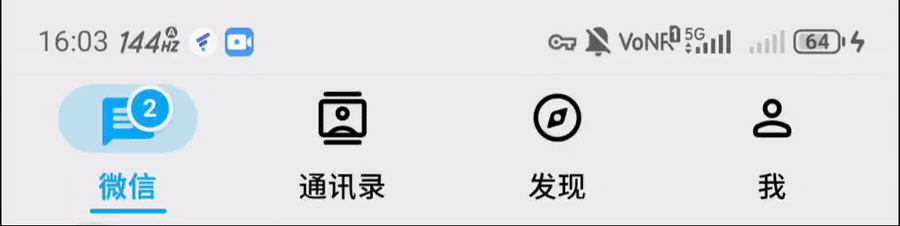
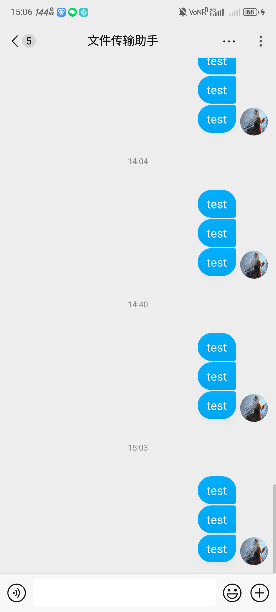
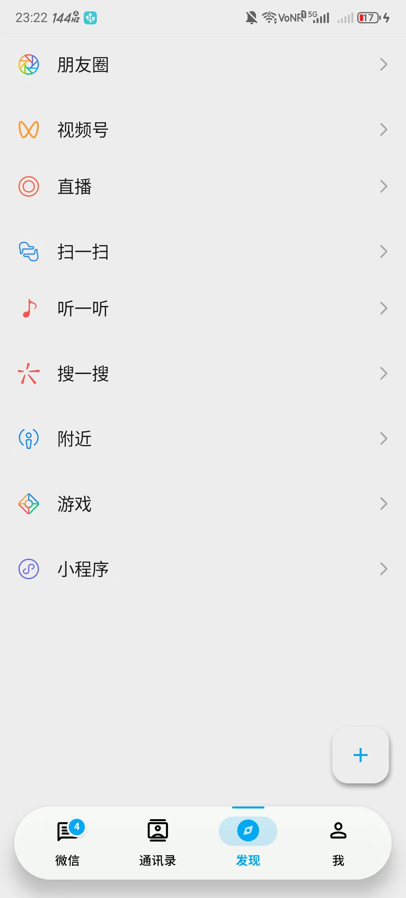

MDWechat
====

# 简介

Fork 自 [Blankeer/MDWechat](https://github.com/Blankeer/MDWechat)，当前维护分支为 `MD3v1.0`。

这是一个面向微信界面的 Xposed / LSPosed 美化模块。当前本地维护版本主要围绕微信 `8.0.49` 国内版做 Material 3 风格适配，同时保留原 MDWechat 的部分历史功能。

- 最新发布：[MD3 v1.1.2](https://github.com/GIT-LINCC/MDWechat/releases/tag/v1.1.2)
- 主要实测微信版本：`8.0.49`
- 历史支持范围：`6.7.3 - 8.0.49`
- Android 要求：`minSdk 21`，Android 5.0 及以上

# 效果预览

| 主界面动态预览 | 聊天气泡 | 发现页悬浮底栏 |
| --- | --- | --- |
|  |  |  |

# 主要特性

1. 主界面 Material 3 风格重绘，覆盖微信、通讯录、发现、我等入口页面。
2. 底部 TabLayout 支持 WebView 渲染、自定义图标、badge、点击动画和滑动指示器。
3. 可选悬浮底栏样式，让底部 Tab 呈现胶囊式悬浮效果，同时保留原有颜色、图标、badge 和动画。
4. 悬浮按钮支持 Material 3 圆角矩形形态，保留原按钮入口、图标和菜单行为。
5. 会话列表、通讯录、发现页等主界面列表去分割线，并保留 Ripple 按压反馈。
6. 聊天气泡支持 MD3 风格智能分组、连续消息圆角联动、阴影层次、头像/昵称对齐、引用消息适配和自定义文本颜色。
7. 常见聊天卡片 MD3 化，覆盖图片、视频、语音、通话、红包、转账、网页链接、小程序、位置、个人名片等消息。
8. 支持全局头像圆角、状态栏颜色、ActionBar 颜色、主界面字体颜色和背景图配置。
9. 支持识别微信深色模式，并按当前模式调整配色。
10. 支持隐藏本机微信号、识别微X模块入口并移动到悬浮按钮。

# 近期更新

## v1.1.2

- 修复通讯录普通快速滑动和右侧字母索引拖动时的严重卡顿。
- 限制聊天气泡 RecyclerView hook 的作用范围，非聊天列表不会再进入气泡识别和渲染逻辑。
- 减少通讯录页面高频主线程处理，缓存联系人根布局、头部样式状态、联系人行子 view、容器列表和 ripple drawable。
- 保留企业联系人、通讯录头部、TabLayout WebView、底栏颜色动画和悬浮按钮视觉效果。

## v1.1.1

- 清理发布展示图中的私人联系人文本。
- 保持 MD3 主界面和聊天气泡效果不变。

## v1.1

- 新增底部 TabLayout 悬浮底栏开关。
- 新增悬浮按钮圆角矩形开关。
- 新增 `webview/tablayout/index.html` 预览页，用于在浏览器中检查 TabLayout WebView 的图标、badge、指示器、顶/底布局和动画。
- 完善发现页、通讯录页、主界面底栏和悬浮按钮的视觉组合。

## MD3v1.0

- 重做 Material 3 主界面视觉。
- 重构聊天气泡分组、卡片识别和媒体消息渲染。
- 增加调试脚本和实机验证流程，方便快速安装、采样、截图和收集日志。

# 构建与调试

命令行构建建议使用 JDK 17。当前本地常用环境为 `AGP 7.1.2 + Gradle 7.5 + Kotlin 1.6.21`。

```powershell
$env:JAVA_HOME='C:\Users\lcc\.jdks\jbr-17.0.6'
$env:PATH="$env:JAVA_HOME\bin;$env:PATH"
.\gradlew.bat :app:assembleDebug
```

安装到设备并重启微信：

```powershell
pwsh .\tools\android\install.ps1 -NoBuild
```

TabLayout WebView 预览：

```powershell
pwsh .\tools\web\serve-tablayout-preview.ps1
# http://127.0.0.1:4173/webview/tablayout/index.html
```

常用调试脚本：

```powershell
pwsh .\tools\android\capture.ps1
pwsh .\tools\android\trace-storage.ps1
pwsh .\tools\android\logcat-control.ps1 -Action Enable
```

# 验证记录

`v1.1.2` 发布前已执行：

```powershell
.\gradlew.bat :app:compileDebugKotlin
.\gradlew.bat :app:assembleDebug
pwsh .\tools\android\install.ps1 -NoBuild
.\gradlew.bat :app:testDebugUnitTest --tests com.blanke.mdwechat.util.ContactPageStyleResolverTest
```

通讯录性能复测结果：

- 普通快速滑动：`609` 帧中 `4` 帧 jank，`95th=10ms`，`99th=18ms`。
- Simpleperf：通讯录滚动中聊天气泡渲染热点消失，`ContactHooker` / `ListViewHooker` 均约 `0.5%`。

# 版本支持

- 当前 MD3 分支主要针对微信 `8.0.49` 国内版。
- `6.7.3 - 8.0.49` 的历史功能仍保留，但微信内部布局变化较大，不保证每个功能在旧版本上都有一致效果。
- Play 版微信、深度定制 ROM、不同 LSPosed / Xposed 框架组合可能需要单独验证。

# 已知限制

1. 聊天气泡依赖微信消息列表、消息行和卡片结构，微信更新后可能需要重新适配。
2. 悬浮按钮和悬浮底栏依赖主界面容器层级，部分机型或框架组合可能出现位置差异。
3. 沉浸背景时，朋友圈顶栏图片在部分分辨率上可能显示错位。
4. 当前 README 中的效果图来自实机调试，不代表所有机型的像素级表现。

# 感谢

1. [Blankeer/MDWechat](https://github.com/Blankeer/MDWechat)
2. [WechatSpellbook](https://github.com/Gh0u1L5/WechatSpellbook)
3. [WechatUI](https://www.coolapk.com/apk/ce.hesh.wechatUI)
4. [群消息助手](https://github.com/zhudongya123/WechatChatroomHelper)
5. [WechatMagician](https://github.com/Gh0u1L5/WechatMagician)
6. [ForceWechatDarkMode](https://github.com/chouqibao/ForceWechatDarkMode)

(背景图片来源于网络)
